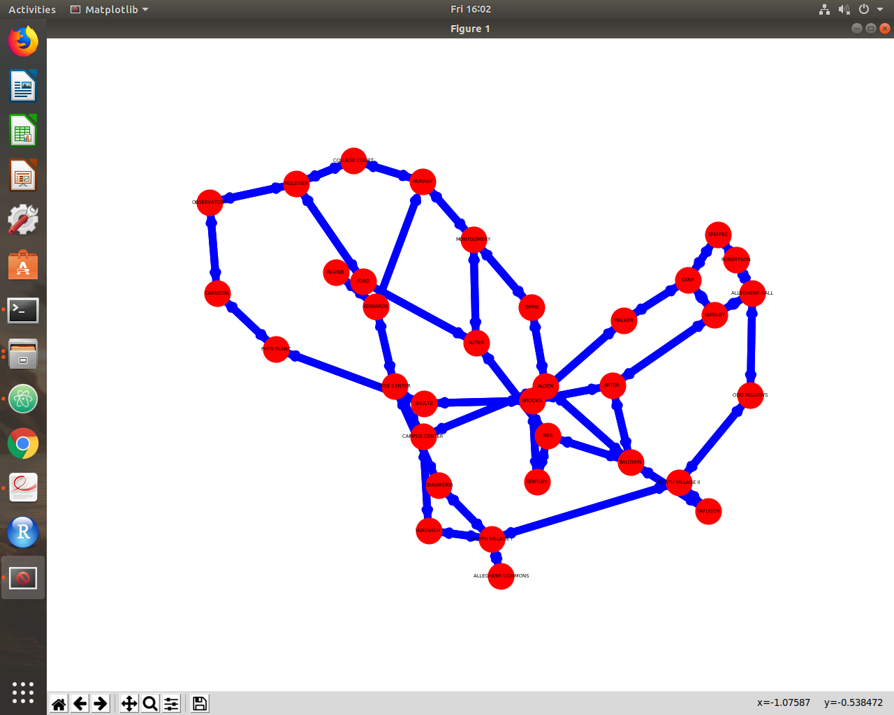
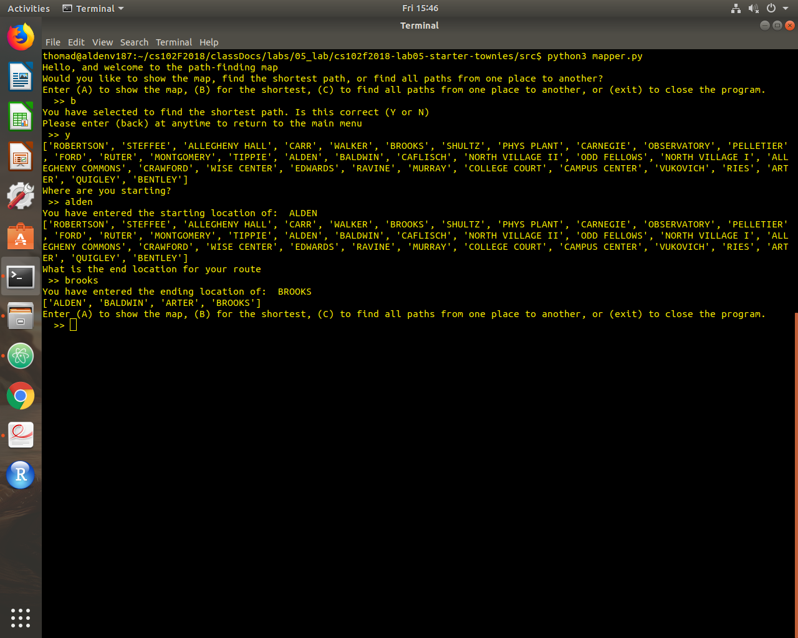
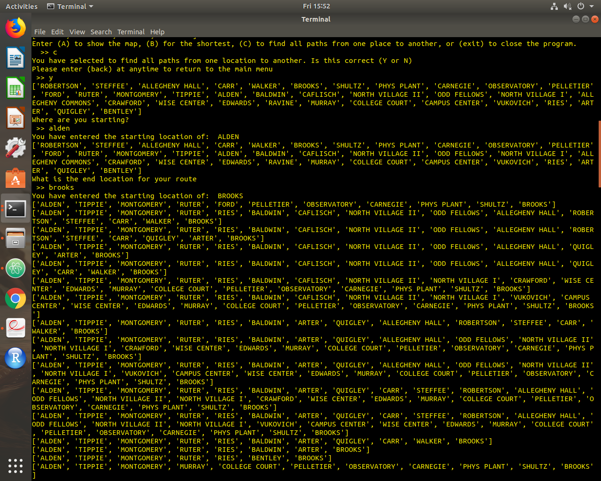
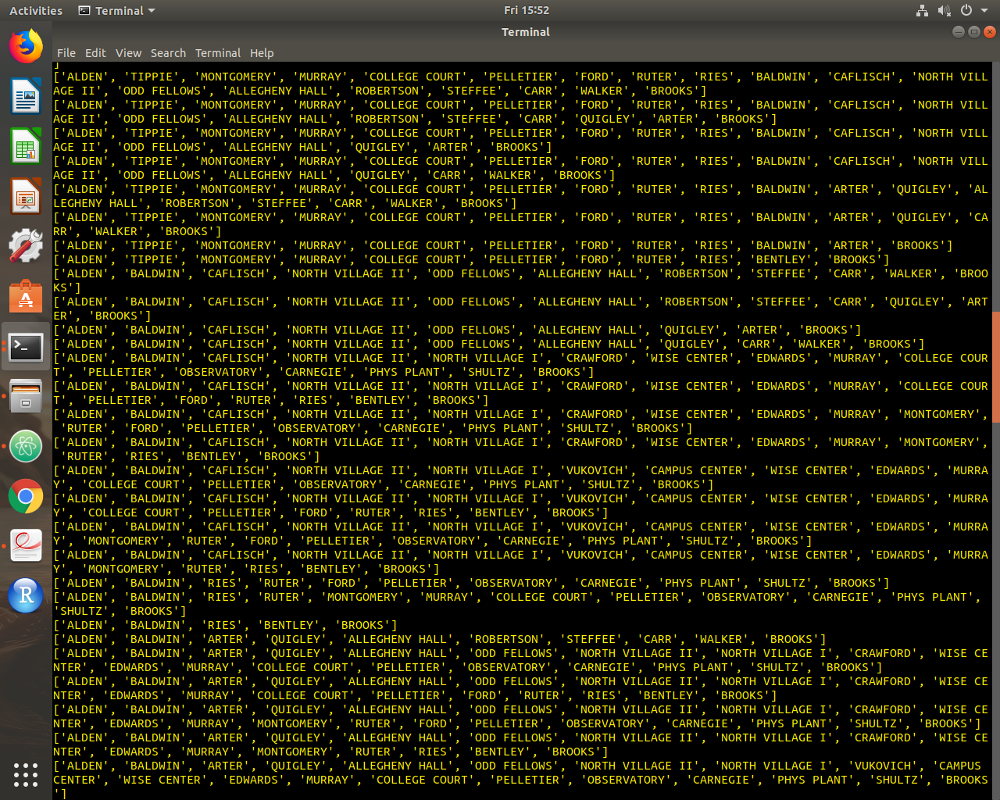

# Final Project Report

## Date: 07 Dec 2018
## Group Names: Nicholas Tocci, Rowan Castellanos, Ben Watto, Dillon Thoma

<!-- Your final report should highlight the key contributions of your work and consist of at least six high quality paragraphs with a minimum of 200 words in each. The report should include a description of why the chosen topic is important and discuss the implementation that you undertook. -->

## Motivation for the Project
Our motivation for this project was to build off of the graph theory section of our course, and focus on the Traveling Salesman Problem. This problem is a classic graph theory problem regarding optimization, and asks the following question: "Given a list of cities and the distances between each pair of cities, what is the shortest possible route that visits each city and returns to the origin city?" This problem has applications in theoretical math, especially graph theory. It also has many applications in theoretical computer science, especially when programmers are thinking about efficient algorithm design. The main example of this application is the Seven Bridges Problem, which dealt with the city of Königsberg, Prussia and trying to devise a path to get across each of the seven bridges once and only once. For this project, we adapted the Traveling Salesman Problem to find the shortest paths between buildings on campus, rather than cities on a map. We took campus locations such as all of the academic buildings, resident halls, the Campus Center, Robertson Athletic Complex, and the Wise Center and implemented an algorithm to calculate the shortest possible routes between them. The output is the shortest path around Allegheny’s campus that visits each academic building in which a particular student has class starting from their resident hall or some other specified campus location. The application we chose is important and useful because it allows students to manage their time in the most efficient way in regards to getting from one place to another on campus. It calculates the shortest possible path to take to get between any two locations, and gives the user the exact path to walk to optimize the route they take.

## Detailed Description
We began by constructing a graph of the campus by looking at a map online and drawing our own. Each building on campus was a vertex 'v' placed on a graph 'G'. We then connected the vertices on 'G' by adding edges to connect the buildings represented by vertices. These connections were the paths or sidewalks connecting the buildings on campus. These edges on 'G' connecting the vertices represent all the ways in which a student can get to class or otherwise travel around campus. The first graph we developed was very closely related to the actual layout of the campus. We were trying to mimic the sidewalks very closely, but this lead to a cluttered graph with excess vertices. We redrafted our graph to remove these excess vertices, and make it more of a direct path between the main vertices. The next step involved assigned weights to each of the edges. Weights were determined depending on how long each path takes to walk. We set out and actually walked these paths and timed them with a stopwatch to ensure accurate data. An example of this is say it takes thirty seconds to walk the path from the Campus Center to Alden Hall. The corresponding edge connecting those pairs of vertices would be represented by .5 on the graph. We also must note that we made each path bidirectional since you can walk back and forth on any of them. This means that for each edge, we actually had two weights that may be different in some cases. For example, if you are walking from the Campus Center to the Library there will be one weight, but a separate one for walking from the Library to the Campus Center, even though the edge is the same. In this example, the second weight would be higher because it is uphill from the Library to the Campus Center, so it will take slightly longer to walk.

## Algorithm and Implementation
Next we began our shortest path algorithm. We used Dijkstra’s Algorithm to calculate the shortest path. Network X has a nice implementation of this which we were able to use in our code. Using our algorithm, we can then produce an optimized route for students to take to class. We also used a 'REPL' to guide users through the program. REPL stands for read, evaluate, print, loop. Basically what this does in our program is takes user's input of the place where they are starting off their walk as well as where they would like to end up, evaluating the input via the algorithm, and returning the results to the user as output in the terminal window. We also implemented a '.txt' file that contains all of the weights of the edges between each building on campus. For the sake of time, we only calculated the weights of paths from a building to the buildings directly connected by a sidewalk because the program will take all of the edges and combine them to find the shortest path, rather than timing how long it takes to walk (for example) from Robertson down to Shultz. We then implemented while loops that would run whenever the user inputs the requested questions. Next, we used a method from Network X called 'calculateShortestPath' that took the user input and actually calculated the shortest path using the map and the weights of the edges between vertices.

## UML Diagrams or a Flowchart Showing Your Project’s Software Design
How classes are interacting with each other. To see an example of including an image in the Markdown document, please see “Mastering Markdown” GitHub guide found at https://guides.github.com/features/mastering-markdown/.

<!-- TODO: draw.io -->

## Description of Results
The final output of our program is the most efficient way for a student to get to class (or some other specified destination). The program offers the user four initial choices when running the program using the command 'python3 mapper.py'. These options are (A) to show the map, (B) to find the shortest path between two places, (C) to see every possible path from one place to another, and (exit) to exit the program. When the user chooses the first option (A), the computer will generate a graph based on the values we inputted for the weights of each edge. The first screenshot shows an example of a computer generated graph based on what the computer thinks the campus looks like based on the input. The graph changes each time because the computer's interpretation varies each time a graph is compiled. If the user selects option (B), the program will output "You have selected to find the shortest path. Is this correct (Y or N). Please enter (back) at anytime to return to the main menu." Once typing 'Y', the user will then be prompted to input their desired starting and ending points on campus that they would like to travel between. The program outputs a list of all the possible places, and prompts the user to select a starting point first followed by an end point. At this step, the program will output the shortest possible path between these two vertices based on the weights of each edge. It specifically outputs each building you will pass while walking on the path to ensure an optimized route. An example of what this looks like in the terminal window can be seen by the second screenshot below, illustrating the shortest path from Alden to Brooks. If the user were to select option (C), the same prompts would come up about starting and ending points. However, the program will calculate every possible path between the two inputted locations, and output them all separately. This is interesting to see how many different routes there are to get from one point to another on campus, and how the most efficient way compares to the rest. The third and final screenshots show some of the possible paths that can be taken, and there were about 3 more screens worth of paths that we did not include in these images. The final option (exit) quits the program.

 (A)

 (B)

 (C)

 (C, cont.)

## Teamwork
If you worked in a team, you should also include a paragraph that describes the team work and the contribution of each team member

## Conclusion
The goal of this project was to explore the graph theory section of our course. Our focus was the Traveling Salesman Problem, which we incorporated for Allegheny's campus so that a list of buildings and the distances between each is given. This is used to calculate the shortest possible route that visits these academic buildings. Weights were given between each building to represent the time it takes to travel, so a weight of 1.00 represents one minute of walking. Our application could be used throughout campus by students to help them travel around campus, whether it is making sure they are at class on time or using it to navigate to the correct building without getting lost. The results of the program allow the user to input their starting point and ending point to find the quickest path to take. A map is also created using the weights across campus to represent the distance between buildings. This project taught us a deeper understanding of graph theory and the Seven Bridges of Königsberg problem by connecting it to an application that we use in our everyday lives. Our biggest challenge for this project was constructing the graph and gathering the time measurements between buildings, because it required us walking each path twice because our program is bidirectional. The biggest reward from our program is the uses it has for incoming Allegheny Students. New students are informed of the quickest path from building to building, and even if they only know a few landmarks, they could still reach their destination. If we had more time, we would have looked into developing an app that would allow our program to be used more efficiently by users anywhere.
